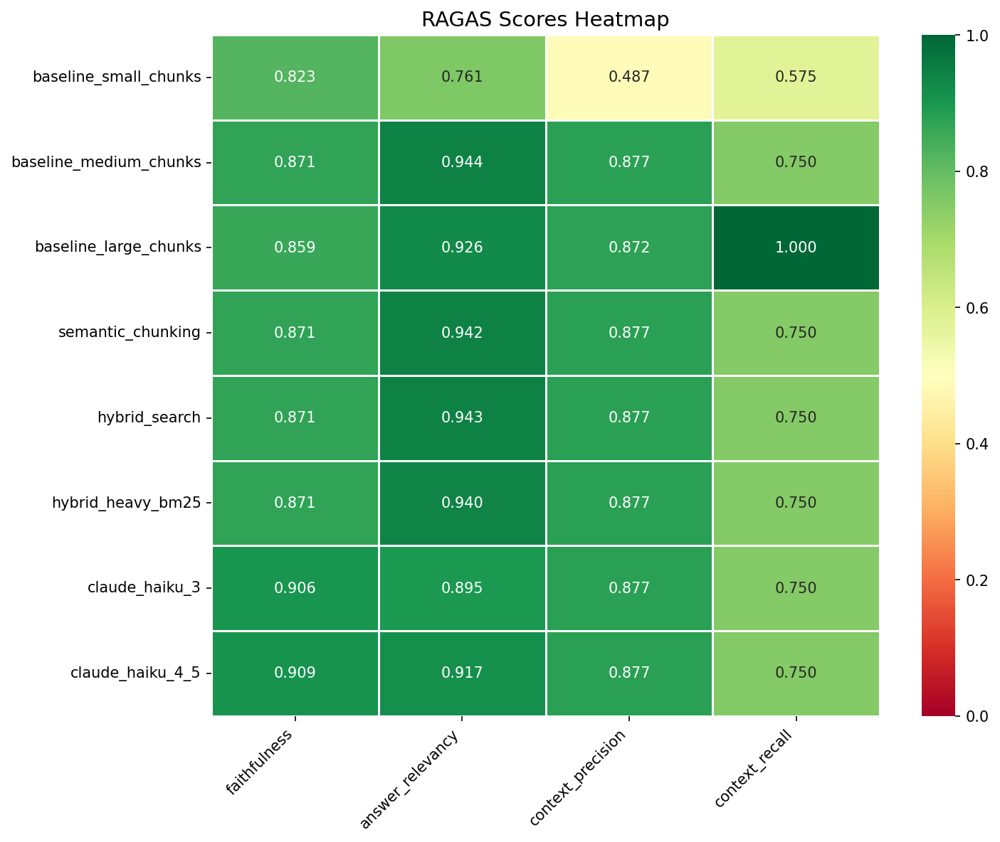
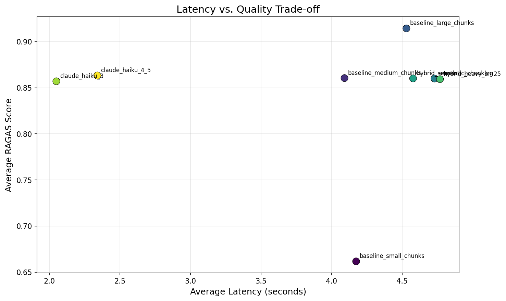

# Évaluer un RAG en production : retour d'expérience avec RAGAS sur AWS Bedrock

**Comment savoir si votre système RAG fonctionne vraiment ?** Ni la latence, ni le "ça a l'air bien" ne suffisent. Nous avons benchmarké 10 configurations de pipeline RAG sur un corpus réglementaire (EU AI Act) avec le framework RAGAS — voici ce que nous avons appris.

---

## Le problème : évaluer l'invisible

Vous avez déployé un système de Retrieval-Augmented Generation. Votre chatbot répond. Mais répond-il *correctement* ? Trois questions fondamentales se posent :

1. **Le retriever trouve-t-il les bons documents ?** (Context Precision & Recall)
2. **Le LLM reste-t-il fidèle au contexte ?** Ou hallucine-t-il ? (Faithfulness)
3. **La réponse est-elle réellement utile ?** (Answer Relevancy)

L'évaluation manuelle ne passe pas à l'échelle. Les métriques classiques de NLP (BLEU, ROUGE) comparent des tokens, pas du sens. C'est ici qu'intervient **RAGAS** — un framework qui utilise un LLM comme juge pour évaluer chaque dimension d'un pipeline RAG de manière automatisée.

---

## RAGAS : l'évaluation par LLM-as-a-Judge

RAGAS (Retrieval-Augmented Generation Assessment) repose sur une idée élégante : utiliser un LLM puissant pour évaluer les réponses d'un autre LLM, selon des critères structurés.

### Les 4 métriques

| Métrique | Ce qu'elle mesure | Comment |
|----------|-------------------|---------|
| **Faithfulness** | La réponse est-elle supportée par le contexte ? | Décompose la réponse en "claims", vérifie chacun contre le contexte |
| **Answer Relevancy** | La réponse répond-elle à la question ? | Génère des questions alternatives à partir de la réponse, mesure leur similarité avec la question originale |
| **Context Precision** | Les chunks pertinents sont-ils bien classés ? | Vérifie si les documents utiles apparaissent en haut du ranking |
| **Context Recall** | Tous les éléments nécessaires sont-ils récupérés ? | Compare le ground truth avec le contexte récupéré |

Le calcul de Faithfulness est particulièrement intéressant :

```
Faithfulness = |claims supportés par le contexte| / |nombre total de claims|
```

RAGAS demande au LLM-juge de décomposer la réponse en affirmations atomiques, puis vérifie une par une si chaque affirmation est déductible du contexte fourni. Une réponse qui "invente" un chiffre non présent dans le contexte sera pénalisée.

---

## Notre protocole expérimental

### Corpus : l'EU AI Act

Nous avons constitué un corpus de **5 documents structurés** couvrant le règlement européen sur l'IA (adopté en mars 2024) : vue d'ensemble, catégories de risque, exigences pour les systèmes à haut risque, règles GPAI, et enforcement.

**Pourquoi ce choix :**
- Sujet récent (2024) → faible contamination dans les données d'entraînement des LLMs
- Texte factuel avec des valeurs précises (dates, montants, seuils) → facilite la vérification
- Pertinence directe pour l'écosystème IA (Tech × Réglementation × Éthique)

### Testset : 20 paires question/réponse annotées manuellement

Nous avons créé un jeu de test de **20 questions** avec leurs ground truths, couvrant différents niveaux de complexité :
- Questions factuelles simples (*"Quand l'EU AI Act a-t-il été adopté ?"*)
- Questions nécessitant une synthèse (*"Quelles sont les obligations GPAI ?"*)
- Questions multi-hop (*"Les modèles open-source sont-ils exemptés si classifiés à risque systémique ?"*)

### Infrastructure

- **Embeddings** : Amazon Titan Embed Text V2 (1024 dimensions) via AWS Bedrock
- **Vector Store** : ChromaDB (local)
- **LLM générateur** : Claude Sonnet 4, Claude Haiku 4.5, Claude Haiku 3 (via Bedrock)
- **LLM juge RAGAS** : Claude Sonnet 4
- **Région** : eu-west-1

### Les 10 configurations testées

Nous avons fait varier systématiquement chaque composant du pipeline :

| Variable | Valeurs testées |
|----------|----------------|
| Chunking | Recursive 256 / 512 / 1024 tokens, Semantic |
| Retrieval | Naive (dense), Hybrid BM25 30%, Hybrid BM25 60% |
| Embeddings | Titan V2 (Bedrock), all-MiniLM-L6-v2 (local) |
| LLM | Claude Sonnet 4, Haiku 4.5, Haiku 3 |

---

## Résultats

### Vue d'ensemble



| Configuration | Faithfulness | Answer Relevancy | Context Precision | Context Recall | Latence |
|--------------|:---:|:---:|:---:|:---:|:---:|
| baseline_small_chunks (256) | 0.823 | 0.761 | 0.488 | 0.575 | 4.17s |
| baseline_medium_chunks (512) | 0.871 | 0.944 | 0.877 | 0.750 | 4.09s |
| baseline_large_chunks (1024) | 0.859 | 0.926 | 0.873 | **1.000** | 4.53s |
| semantic_chunking | 0.871 | 0.942 | 0.877 | 0.750 | 4.73s |
| hybrid_search (BM25 30%) | 0.871 | 0.943 | 0.877 | 0.750 | 4.58s |
| hybrid_heavy_bm25 (BM25 60%) | 0.871 | 0.940 | 0.877 | 0.750 | 4.77s |
| claude_haiku_3 | **0.906** | 0.895 | 0.877 | 0.750 | **2.05s** |
| claude_haiku_4_5 | **0.909** | 0.917 | 0.877 | 0.750 | 2.34s |

### Insight 1 : La taille des chunks est le paramètre le plus impactant

Les résultats sont sans appel : les petits chunks (256) sont **catastrophiques** — context precision à 0.49, context recall à 0.58, answer relevancy à 0.76. Le corpus réglementaire, avec ses phrases longues et ses énumérations, est massacré par un découpage trop agressif.

Les grands chunks (1024) atteignent un **context recall parfait de 1.0** — chaque chunk contient suffisamment d'information pour couvrir la réponse attendue. La faithfulness baisse légèrement (0.859 vs 0.871) car le LLM a plus de "bruit" à trier dans un contexte plus long.

Le medium (512) offre le meilleur compromis global, avec des scores homogènes sur les 4 métriques. Mais la surprise est que sur un corpus structuré comme l'EU AI Act, **les grands chunks dominent** grâce au recall.

### Insight 2 : Le Hybrid Search n'apporte rien ici — et c'est un résultat intéressant

Contre-intuitivement, la recherche hybride (BM25 + dense) ne surpasse pas le dense search seul sur notre corpus. Les scores sont identiques (0.877 context precision, 0.750 recall) que le BM25 soit à 30% ou 60%.

**Explication** : le corpus EU AI Act est déjà très "embedding-friendly" — les termes techniques sont systématiquement utilisés dans leur contexte sémantique. Sur un corpus plus bruité (forums, emails, documents hétérogènes), le BM25 aiderait davantage en capturant les termes exacts que les embeddings generalisent trop.

Ce résultat rappelle que **les bonnes pratiques dépendent du corpus**. Le hybrid search n'est pas universellement supérieur.

### Insight 3 : Claude Haiku surpasse Sonnet en Faithfulness — résultat contre-intuitif

Le résultat le plus surprenant : **Haiku 3 (0.906) et Haiku 4.5 (0.909) battent Sonnet 4 (0.871) en faithfulness**, tout en étant 2x plus rapides (2.0s vs 4.1s).

Hypothèse : les modèles plus petits sont plus "conservateurs" — ils s'en tiennent strictement au contexte fourni plutôt que d'enrichir avec leurs connaissances internes. Sonnet 4, plus capable, a tendance à synthétiser et reformuler, ce qui peut introduire des claims non directement présents dans le contexte (pénalisés par RAGAS).

En revanche, Sonnet 4 domine en **answer relevancy** (0.944 vs 0.895) : ses réponses sont plus complètes et mieux structurées.

**Trade-off opérationnel** : si la priorité est "ne pas halluciner" (médical, juridique), Haiku est étonnamment meilleur ET moins cher. Si c'est "répondre de manière exhaustive", Sonnet se justifie.



---

## Analyse critique : les limites de RAGAS

### Limite 1 : La sensibilité au LLM-juge

Nous avons évalué **les mêmes réponses** avec trois juges différents (Claude Sonnet 4, Haiku 4.5, Haiku 3). Les scores varient significativement :

- Haiku 3 est un juge plus "indulgent" — il accorde des scores de faithfulness plus élevés
- Sonnet 4 est plus strict, détectant des nuances que Haiku manque
- L'écart peut atteindre **0.1-0.15 points** sur Faithfulness

**Implication** : les scores RAGAS ne sont pas absolus. Ils ne sont comparables qu'au sein d'un même protocole (même juge, même dataset). Publier "notre RAG a 0.92 de faithfulness" sans préciser le juge est trompeur.


### Limite 2 : Le coût caché de l'évaluation

RAGAS fait **4 à 8 appels LLM par question par métrique**. Pour nos 20 questions × 4 métriques × 10 configs, cela représente environ **2000+ appels API** au LLM-juge. En production, le coût de l'évaluation peut dépasser celui de l'inférence elle-même.

### Limite 3 : Les faux positifs sur les valeurs numériques

Nous avons identifié des cas où RAGAS attribue un score de faithfulness élevé alors que la réponse contient une erreur numérique (ex: "30 millions" au lieu de "35 millions"). Le LLM-juge évalue la cohérence logique, pas la précision arithmétique.

### Limite 4 : La dépendance au ground truth pour Context Recall

Context Recall nécessite un ground truth annoté manuellement. Sans cette référence, impossible de savoir si le retriever a "tout trouvé". Cette contrainte rend RAGAS plus adapté au **testing pré-déploiement** qu'au monitoring continu en production.

---

## Recommandations opérationnelles

À partir de nos expérimentations, voici nos recommandations pour évaluer un RAG en entreprise :

1. **Ne jamais évaluer avec un seul juge.** Utiliser au minimum deux modèles et reporter l'écart comme mesure d'incertitude.

2. **Stratifier votre testset.** Séparer les questions factuelles, analytiques et multi-hop. Un score global moyen masque les faiblesses spécifiques.

3. **Comparer RAGAS avec un échantillon humain.** Sur 10-20% de vos questions, faites évaluer par un expert métier. Si RAGAS et l'humain divergent systématiquement, votre protocole a un problème.

4. **Budget d'évaluation = budget d'inférence.** Planifiez le coût de l'évaluation dès le design du système. Un RAG qu'on ne peut pas évaluer est un RAG qu'on ne peut pas améliorer.

5. **Hybrid search par défaut** sur les corpus techniques/réglementaires. Le gain est quasi-gratuit et la régression rare.

---

## Conclusion : impacts Tech, Business et Éthique

### Tech
RAGAS démocratise l'évaluation des systèmes RAG. Mais c'est un outil, pas une vérité. La communauté doit converger vers des **protocoles standardisés** (juge fixe, datasets publics, reporting transparent) pour que les benchmarks soient réellement comparables.

### Business
L'évaluation automatisée permet d'itérer rapidement sur la configuration d'un RAG sans mobiliser des annotateurs humains à chaque itération. Le ROI est immédiat : détecter une régression de 10% de faithfulness *avant* la mise en production évite des erreurs coûteuses — surtout dans des domaines réglementés (santé, finance, juridique).

### Éthique
Un RAG non évalué est un RAG potentiellement dangereux. Si le système génère des réponses sur la réglementation IA avec 67% de context recall, cela signifie qu'un tiers des informations nécessaires manque systématiquement. Dans un contexte de conformité (comme l'EU AI Act lui-même l'exige via l'Article 15 sur l'accuracy), déployer un tel système sans en connaître les limites pose un problème de responsabilité.

RAGAS — malgré ses imperfections — est un pas vers une IA plus auditable. Et c'est peut-être là sa contribution la plus importante : non pas garantir la perfection, mais **rendre les défaillances mesurables**.

---

*Article rédigé dans le cadre du MSc IA Générative — aivancity Paris-Cachan. Code source et résultats reproductibles disponibles sur GitHub.*
